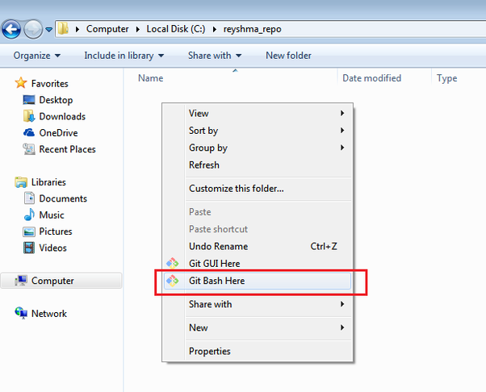

# Quick start to Git and GitHub for Managing Your Research

[Git](https://git-scm.com/?source=post_page---------------------------) is a free and open source distributed vesion control system (VCS), which allows you to backup your file changes and track those changes in case you screw up something. It's by far the most popular VCS both for individual and company use. 

## Why we choose Git

Here are [seven reasons](https://codeburst.io/number-one-piece-of-advice-for-new-developers-ddd08abc8bfa) that you should be using **Git**.

*1. Version Control*

Every version of your code or work is available to you. It's different than the `save` command in Microsoft Word. With Git, every time you commit/upload your code, Git will create a local message to record your changes. So you never lose any changes because they are all saved in the git repository. If you want to revert back three months on a project, you can use a very simple Git command to do that.

*2. Branches*


In Git repository, every change is organized as the time sequence. In some point, you may come up with new ideas to test. 

For instance, you want to build a **Rotational-Raman lidar**. In the beginning, you may think about applying the double-grating to extract the Rotation-Raman signal. But when you finish all the lidar hardware and try to install the double-grating, you may think what about using Narrowband IFs (Feature one) or Etalons (Feature two). Then at this point, you can setup new branches to really try those nice ideas without influencing the original plan (master). 

Git will allow you to create branches at any point and you can also track the changes at each branch, and roll back if you found this idea is like shit.

*3. Working in teams*

Unlike the centralized VCS, which allows only one repository to save the code and documents, Git will enable to create your own repository. 

Git simplifies the process of working with other people and makes it really easy to collaborate on projects. Everybody can have a copy of the project and start the development locally. And then push their own cool features to the project. Everyone in the group can decide whether to accept the feature and merge it into the code.

## How to use Git

First of all, if you don't install `Git`, you need to download it, which you can follow the instructions in [here](https://git-scm.com/book/en/v2/Getting-Started-Installing-Git).

The basic operations in Git are: 

- Initialize
- Add
- Commit 
- Pull
- Push

Some advanced Git operations are:

- Branching
- Merging
- Rebasing

Below is the architecture of Git:


*1. Initialize the Git repository*

> Git is a command line tool, which means you need to type in each command to really apply each operation.

- Windows only: Go to your project folder. Right click and select 'Git Bash here'. This will activate the Git terminal for you.



In the Git terminal, type in 

``` shell
git init
```

- Linux or MacOS: 

``` shell
cd work_folder
git init
```

`git init` creates an empty Git repository or re-initializes an existing one. It basically creates a `.git` folder in the work directory, which will save all the changes you will make in this work directory.

*2. add and commit your changes to Git*

After you intialize the Git repository, Git will detect any your changes inside the work directory. You can use `git status` to see your changes. 

Let's say it's an empty work directory before, and now you create two files: **MUA1.txt** and **MUA2.txt**.


Right now, you still didn't tell Git to record your changes. In order to do that, you need two steps: `git add MUA1.txt MUA2.txt` and `git commit -m "add MUA1 and MUA2"`. The first command will tell git to remember the changes and the second command will tell git to put a group of changes into the branch. One git commit can contain a lot of changes, which you will do during a couple of days. After the commit, the changes are fixed and they can be rolled back according to commit number.


*3. pull from and push to remote git repository*

As we mentioned before, Git enables teamwork. Git provides two mechanisms to synchronize your work with others: `git pull` and `git push`. The former one can help you download the work from remote repository and the latter can upload your work. 

Before you use these two commands, you need to tell which repository you want to synchronize with. This is done with using `git remote add origin <url>`. The **url** is the bridge to connect you with others. Normally you can go to the next chapter of [GitHub](#github) to know how to get this **url** easily.

Let's say you want to `git push` a new file to this repository from your local repository. You can do as below:

``` shell
git remote add origin "git@github.com:ZPYin/How_to_Git.git"
git pull origin master --allow-unrelated-histories  # download the remote repository
git touch playground/MUA3.txt   # create a new file under 'playground'
git add playground/MUA3.txt
git commit -m "test upload MUA3 to How_to_git"
git push origin master   # upload your local work to the remote repository
```

For the advanced features, you can learn how to use them [here][2].

## GitHub

[GitHub][3] is a big platform that provides hosting for software development version control using Git. As of May 2019, it has over 37 million users and more than 100 repositories, which makes it the largest host of source code in the world.

## What is GitHub


You can treat it like a cloud. It can work seamless with Git, therefore you can easily push and pull your project from the remote repository saved in GitHub.

## How to use GitHub

Below are the steps about how to use GitHub [[4][4]]:

*1. Create a GitHub account*

This is very easy to do if you have your own email account. You can follow the instructions [here][5]. 

*2. Create an empty repository*


Click the **New** and finish the settings, then you will have your first GitHub repository.

*3. Make something for your repository*

Since now, there are two ways to fill something inside your repository. GitHub webpage provide easily UI to edit files remotely. And if you want to push your work from local machine. You can follow the instructions in [How_to_use_Git](#how-to-use-git).

*4. Clone and Fork other repository*

```
TODO
```

### Workflow GitHub

Remember if you choose GitHub, all your work could be seen by others unless you choose private repository. Therefore, you need to be familiar how to work with others, either your teamates or other strangers. Go [here][6] for detailed instructions. 

### Rules for GitHub

1. Be sure you are not doing something illegal with using GitHub repository
2. Fill in reasonable git commit messages for each commit to remind you or others of your changes

[1]: https://www.quora.com/What-is-Git-and-why-should-I-use-it
[2]: https://www.liaoxuefeng.com/wiki/896043488029600
[3]: https://github.com/
[4]: https://product.hubspot.com/blog/git-and-github-tutorial-for-beginners
[5]: https://github.com/join
[6]: https://www.liaoxuefeng.com/wiki/896043488029600/896954117292416