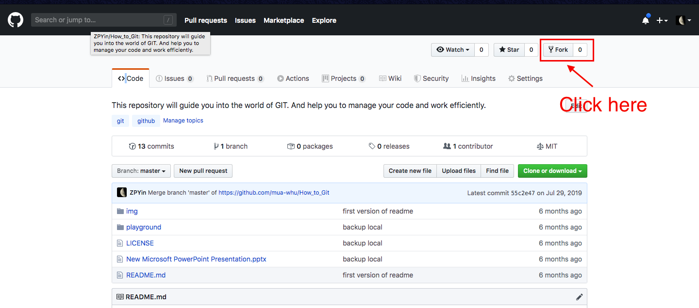
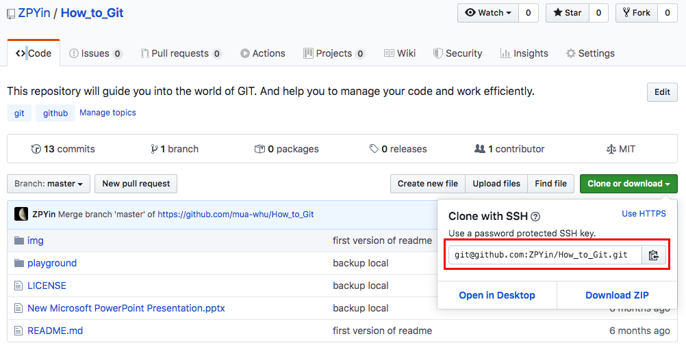
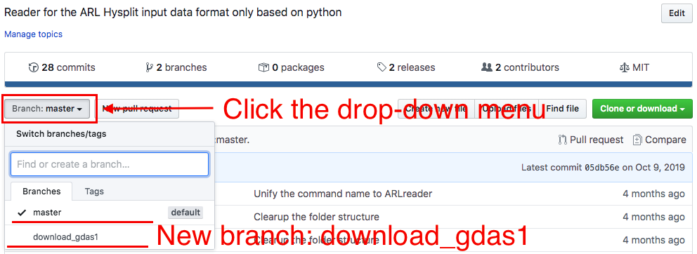
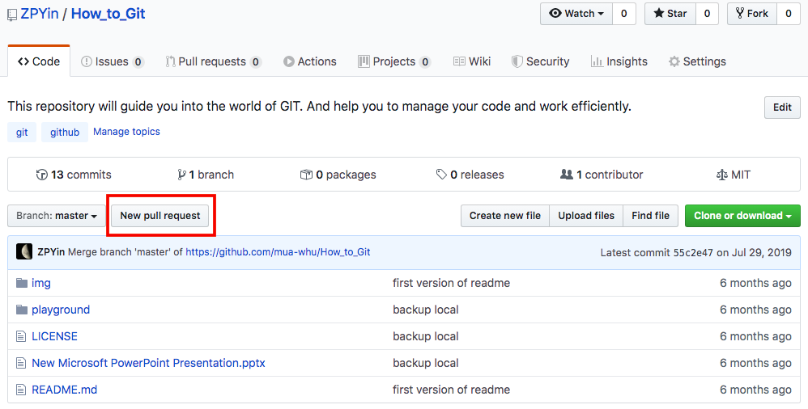
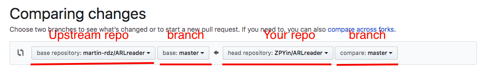

# How to contribute to a repository in GitHub

This doc will guide you through a typical workflow of contributing to a GitHub repository.

## Fork the repository

Visit your interested [repo][1] in GitHub, and click the `fork` as below:

<p align='center'>

<br>
<b>Fork a GitHub repository</b>

> Note: the following commands are supposed to be done in command line, in which [Git][2] is needed.

## Clone the repository

Go back to your own GitHub page, you will find the forked repository in your repository list. Copy the SSH connection and clone the repository to your local machine.

<p align='center'>

<br>
<b>Copy SSH address of the GitHub repository</b>

```bash
git clone [SSH_address]   # clone the GitHub repo to your local PC
cd How_to_Git   # go to the directory of the repo
```

## Create a branch

> It's not recommended to develop in the master branch unless in some urgent recovery. :warning:

According to your development requirement, create a new branch and make all your changes under this new branch.

```bash
git checkout -b [your-branch]
```

## Coding and commit

After you finish your development, commit and submit your changes to your GitHub repository.

```bash
git add .   # stage your changes
git commit   # commit your changes
```

**Details can be found [here](../README.md)**

## Upstream repository change synchronization

To avoid upstream repository change (for instance, the original repository that you forked has been modified), it's necessary to sync your local repository with the upstream repository.

```bash
git remote add upstream [SSH_address_of_the_original_repo]
git fetch upstream   # fetch the recent commit from upstream
```

If there have been changes to the upstream repo already, run `git rebase` first to move the `HEAD` to the upstream commit.

```bash
git rebase upstream/master
```

## Push new branch to the remote repository

```bash
git push -f origin [your-branch]:[your-branch]
```

This command will push [your-branch] to the GitHub repository, which you can check as below:

<p align='center'>

<br>
<b>New branch in GitHub repository</b>

## Create a Pull Request

Create a `Pull Request (PR)` to the upstream repository, as below:

<p align='center'>

<br>
<b>Create new PR in GitHub</b>

Create the `New pull request` in your GitHub repository and then click the `Compare & pull request` in the same page.

<p align='center'>

<br>
<b>Push PR to upstream repository</b>

After you create the PR, the manager of the upstream repository will receive your changes, and then give code review, and decide whether to incorporate your changes.

If the code need to be fixed, you can modify your local repository according to the `review` report from the manager. After you fix the code, run the commands below to adapt your changes.

```bash
git add .
git commit --amend
git push -f origin [your-branch]
```

> If there are conflicts in between, go [here](#resolve-conflicts) for more instructions.

## Cleanup

```bash
git checkout master -f   # checkout to 'master' branch
git pull -ff upstream master   # sync with upstream repository
git branch -D [your-branch]   # delete your local branch
git push origin --delete [your-branch]   # delete your remote GitHub branch
```

## Resolve conflicts

```bash
git fetch upstream   # sync with upstream repository
git rebase upstream/master
```

Fix the conflicts with the prompts from Git, then commit again

```bash
git add my-fix-file
git rebase --continue
git push -f origin [your-branch]
```

After you commit, repeat the [PR](#create-a-pull-request) session again.

[1]: https://github.com/ZPYin/How_to_Git
[2]: https://git-scm.com/